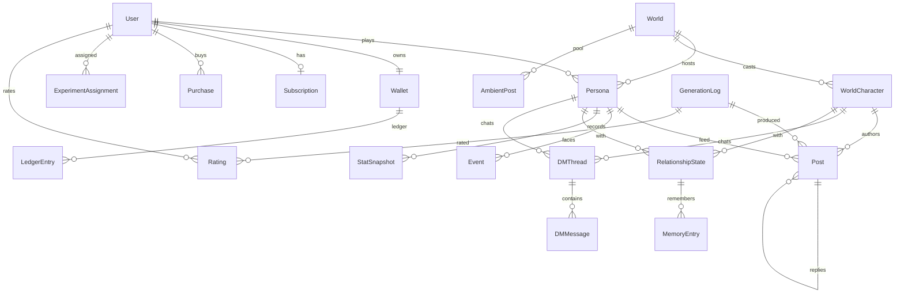

# 02 — Data Schema
- version: 1
- source: ../teardown.md §5(推定 ER)を MVP 用に確定。各 model のコメントに teardown 由来エンティティを記す。
- DB: PostgreSQL / Prisma。演出用の数値(いいね数など)は LLM に生成させず `Post.metrics` にサーバが書く。

## Prisma schema

```prisma
generator client { provider = "prisma-client-js" }
datasource db { provider = "postgresql"; url = env("DATABASE_URL") }

enum Locale { en ja }
enum WorldMode { single multi }          // multi は P1。MVP は single のみ生成
enum PostKind { user character news ambient system }
enum ThreadPartyKind { persona character }
enum LedgerSource { daily_refill ad_reward referral purchase plus_daily spend admin }
enum Currency { energy coffee gems }
enum SubPlan { plus_weekly plus_monthly plus_yearly adfree_monthly }
enum SafetyVerdict { allow soften block }
enum GeneratorId { G1 G2 G3 G4 G5 G7 G8 G9 G10 GJ }

/// teardown: User
model User {
  id            String   @id @default(cuid())
  email         String?  @unique
  authProvider  String            // apple | google | email
  authSubject   String
  birthYear     Int               // 年齢ゲート(13+)。18歳未満は minor=true
  isMinor       Boolean  @default(true)
  locale        Locale   @default(en)
  createdAt     DateTime @default(now())
  personas      Persona[]
  wallet        Wallet?
  subscription  Subscription?
  purchases     Purchase[]
  assignments   ExperimentAssignment[]
  ratings       Rating[]
  @@unique([authProvider, authSubject])
}

/// teardown: Persona(ユーザーが演じるアカウント)
model Persona {
  id          String   @id @default(cuid())
  userId      String
  user        User     @relation(fields: [userId], references: [id])
  worldId     String
  world       World    @relation(fields: [worldId], references: [id])
  handle      String            // @taytay19
  displayName String
  bio         String   @default("")
  avatarUrl   String?
  voiceNotes  String   @default("")   // 口調メモ(AIF-004 で自動抽出、MVP は手入力)
  followers   Int      @default(120)
  aura        Int      @default(20)   // 0..100
  humor       Int      @default(20)   // 0..100
  level       Int      @default(1)
  xp          Int      @default(0)
  actionCount Int      @default(0)    // イベント発火判定に使用
  worldSummary String  @default("")   // G7 が更新する世界要約 ≤400 tok
  createdAt   DateTime @default(now())
  posts       Post[]
  threads     DMThread[]
  relationships RelationshipState[]
  stats       StatSnapshot[]
  events      Event[]
  @@unique([worldId, handle])
}

/// teardown: World
model World {
  id           String    @id @default(cuid())
  slug         String    @unique          // popstar-era, magic-academy, idol-survival
  title        Json                       // {en, ja}
  scenario     Json                       // {en, ja} 1行シナリオ
  bible        Json                       // {en: string, ja: string} G9 出力そのまま(=キャッシュ用 system[1])
  bibleTokens  Int                        // count_tokens で計測(>=4096 を CI で assert)
  mode         WorldMode @default(single)
  isPreset     Boolean   @default(true)
  difficulty   Int       @default(2)      // ★の数
  coverUrl     String?
  createdBy    String?
  createdAt    DateTime  @default(now())
  characters   WorldCharacter[]
  personas     Persona[]
  ambientPool  AmbientPost[]
}

/// teardown: CharacterTemplate + WorldCharacter を MVP では1つに統合(プリセットのみ)
model WorldCharacter {
  id          String  @id @default(cuid())
  worldId     String
  world       World   @relation(fields: [worldId], references: [id])
  handle      String
  displayName String
  role        String            // rival | bestie | press | producer ...
  card        Json              // {en, ja}: 口調/価値観/口癖/NG(bible 内の該当部分と同一文字列)
  avatarUrl   String?
  isPressAccount Boolean @default(false)   // @gmz 型
  canBeFirstFollower Boolean @default(true)
  posts       Post[]
  threads     DMThread[]
  relationships RelationshipState[]
  @@unique([worldId, handle])
}

/// teardown: Post(user|character|news|ambient)
model Post {
  id           String   @id @default(cuid())
  worldId      String
  personaId    String?            // 閲覧主(フィードのオーナー)。ambient は null
  persona      Persona? @relation(fields: [personaId], references: [id])
  authorPersonaId    String?
  authorCharacterId  String?
  authorCharacter    WorldCharacter? @relation(fields: [authorCharacterId], references: [id])
  kind         PostKind
  text         String
  parentId     String?
  parent       Post?    @relation("replies", fields: [parentId], references: [id])
  replies      Post[]   @relation("replies")
  metrics      Json     @default("{}")   // {likes, reposts, replies} 演出値(サーバ計算)
  generationId String?
  generation   GenerationLog? @relation(fields: [generationId], references: [id])
  createdAt    DateTime @default(now())
  @@index([personaId, createdAt])
  @@index([parentId])
}

/// 公開ワールド共有の雑談プール(G2, Batch 生成)
model AmbientPost {
  id          String   @id @default(cuid())
  worldId     String
  world       World    @relation(fields: [worldId], references: [id])
  characterId String
  locale      Locale
  text        String
  createdAt   DateTime @default(now())
  @@index([worldId, locale])
}

/// teardown: DMThread / DMMessage
model DMThread {
  id           String   @id @default(cuid())
  personaId    String
  persona      Persona  @relation(fields: [personaId], references: [id])
  characterId  String
  character    WorldCharacter @relation(fields: [characterId], references: [id])
  lastMessageAt DateTime @default(now())
  unreadCount  Int      @default(0)
  messages     DMMessage[]
  @@unique([personaId, characterId])
}
model DMMessage {
  id        String   @id @default(cuid())
  threadId  String
  thread    DMThread @relation(fields: [threadId], references: [id])
  fromCharacter Boolean
  text      String
  generationId String?
  createdAt DateTime @default(now())
  @@index([threadId, createdAt])
}

/// teardown: Event(ドラマカード)+ EventChoice(JSON 埋め込み)
model Event {
  id         String   @id @default(cuid())
  personaId  String
  persona    Persona  @relation(fields: [personaId], references: [id])
  title      String
  prompt     String                 // 「匿名ソースが…どう応じる?」
  choices    Json                   // [{id, label, outcomeText, statDeltas:{followers,aura,humor}, relationshipDeltas:{characterId:int}}] ×3
  chosenId   String?
  resolvedAt DateTime?
  generationId String?
  createdAt  DateTime @default(now())
  @@index([personaId, resolvedAt])
}

/// teardown: StatSnapshot(アクション毎の差分)
model StatSnapshot {
  id         String   @id @default(cuid())
  personaId  String
  persona    Persona  @relation(fields: [personaId], references: [id])
  cause      String            // post:<id> | event:<id> | dm:<id>
  narrative  String            // 1〜2文(G1/G5 出力)
  followersDelta Int
  auraDelta  Int
  humorDelta Int
  relDeltas  Json              // {characterId: +1|-1}
  createdAt  DateTime @default(now())
}

/// teardown: RelationshipState + MemoryEntry
model RelationshipState {
  id          String   @id @default(cuid())
  personaId   String
  persona     Persona  @relation(fields: [personaId], references: [id])
  characterId String
  character   WorldCharacter @relation(fields: [characterId], references: [id])
  affinity    Int      @default(0)      // -100..100
  summary     String   @default("")     // ≤150 tok(G7)
  isFollower  Boolean  @default(false)
  memories    MemoryEntry[]
  @@unique([personaId, characterId])
}
model MemoryEntry {
  id             String   @id @default(cuid())
  relationshipId String
  relationship   RelationshipState @relation(fields: [relationshipId], references: [id])
  note           String            // G1 の memory_notes 1件
  sourceRef      String            // post:<id>
  consolidated   Boolean  @default(false)
  createdAt      DateTime @default(now())
}

/// teardown: Wallet / LedgerEntry(エネルギー・Coffee・Gems)
model Wallet {
  id        String  @id @default(cuid())
  userId    String  @unique
  user      User    @relation(fields: [userId], references: [id])
  energy    Int     @default(10)
  coffee    Int     @default(0)
  gems      Int     @default(0)
  dailyRefillAt DateTime @default(now())
  adRewardsToday Int @default(0)
  entries   LedgerEntry[]
}
model LedgerEntry {
  id        String   @id @default(cuid())
  walletId  String
  wallet    Wallet   @relation(fields: [walletId], references: [id])
  currency  Currency
  delta     Int
  source    LedgerSource
  ref       String?
  createdAt DateTime @default(now())
  @@index([walletId, createdAt])
}

/// teardown: Purchase / Subscription(RevenueCat webhook で更新)
model Purchase {
  id         String   @id @default(cuid())
  userId     String
  user       User     @relation(fields: [userId], references: [id])
  sku        String
  store      String            // app_store | play | stripe
  amountUsd  Decimal  @db.Decimal(8,2)
  rcEventId  String   @unique
  createdAt  DateTime @default(now())
}
model Subscription {
  id        String   @id @default(cuid())
  userId    String   @unique
  user      User     @relation(fields: [userId], references: [id])
  plan      SubPlan
  active    Boolean
  renewsAt  DateTime?
  rcSubscriberId String
}

/// LLM 呼び出しの全ログ(cost-architecture §6.1)
model GenerationLog {
  id           String   @id @default(cuid())
  userId       String?
  generator    GeneratorId
  variantId    String
  model        String
  promptHash   String
  inputTokens  Int
  cacheWriteTokens Int
  cacheReadTokens  Int
  outputTokens Int
  costUsd      Decimal  @db.Decimal(10,6)
  ttftMs       Int?
  latencyMs    Int
  stopReason   String
  safetyVerdict SafetyVerdict?
  escalatedFrom String?           // 再生成時の元 log id
  createdAt    DateTime @default(now())
  posts        Post[]
  ratings      Rating[]
  @@index([generator, variantId, createdAt])
  @@index([userId, createdAt])
}
model ExperimentAssignment {
  id        String   @id @default(cuid())
  userId    String
  user      User     @relation(fields: [userId], references: [id])
  experimentKey String
  variantId String
  createdAt DateTime @default(now())
  @@unique([userId, experimentKey])
}
model Rating {
  id           String   @id @default(cuid())
  userId       String
  user         User     @relation(fields: [userId], references: [id])
  generationId String
  generation   GenerationLog @relation(fields: [generationId], references: [id])
  value        Int               // -1 | +1
  regenerate   Boolean  @default(false)
  createdAt    DateTime @default(now())
}
```

## ER 図



## 不変条件
- 1アクション(投稿/返信/DM/イベント選択)= `Wallet.energy -1` の LedgerEntry(source=spend)を**同一トランザクション**で記録。energy=0 なら 402 を返し画面は SCR-032 へ。
- `World.bible[locale]` は G9 出力文字列をそのまま保存し、以後変更しない(プロンプトキャッシュのバイト一致条件)。
- `GenerationLog` は失敗・拒否(stop_reason=refusal)も含め全件記録。
