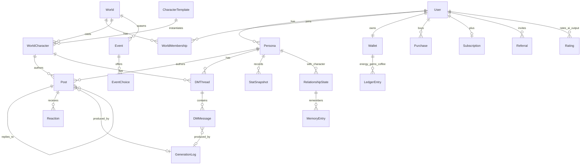

# Teardown: Status — "Sims but social media" (WishRoll Inc.)
- source_urls:
  - https://www.statusai.com/ (LP, /press, /help, /faqs, /community-guidelines)
  - https://apps.apple.com/us/app/status-sims-but-social-media/id6596771144 (説明・IAP・レビュー・スクショ5枚)
  - https://play.google.com/store/apps/details?id=link.socialai.app
  - https://techcrunch.com/2026/05/19/gamified-social-media-network-status-announces-17m-funding-to-help-usher-in-new-era-of-social-networking/
  - https://inworld.ai/blog/wishroll-status-cutting-ai-costs-by-95-percent / https://inworld.ai/customers/status (AIコスト95%削減の事例)
  - https://www.pocketgamer.biz/how-status-created-a-million-user-ai-social-simulation-in-a-month/
  - https://ventureradar.substack.com/p/this-ai-powered-social-game-makes ($200K/月時点の分析)
  - https://screensdesign.com/showcase/status-sims-but-social-media (画面フロー・ペイウォール分析)
  - https://www.isekaizero.ai/blog/status-ai-review, https://tvtropes.org/pmwiki/pmwiki.php/VideoGame/Status, https://india.entrepreneur.com/news-and-trends/how-this-entrepreneur-built-the-architecture-for-rapid-ai/497069
- date: 2026-09-04
- user_requirements: (1) 徹底調査 (2) スーパーコピーして上回る (3) クロスプラットフォーム (4) プロンプト分割・モデル最適化・A/Bテストで LLM コストを大幅削減 → 詳細は `cost-architecture.md`
- confidence: medium-high(公開情報+公式スクショ+Inworld事例で裏取り。画面遷移の細部と Plus の正確な価格は推定含む)

---

## 0. TL;DR(なぜ「LLM×ToCの正解」なのか)

| 指標 | 値 | 出典 |
|---|---|---|
| 公開ローンチ | 2025年1月(β: 2024年8月〜, Discord/TikTok経由で10万DL) | PocketGamer / 公式Press |
| 100万ユーザー到達 | ローンチ後19日(ChatGPT以降最速級) | 公式Press |
| DAU | 50万+(ローンチ1ヶ月時点) | Inworld / PocketGamer |
| 平均プレイ時間 | 1時間36分/日(平均35分→パワーユーザー90分超) | Inworld / 公式Press |
| 生成量 | ワールド1,300万、キャラプロフィール500万 | TechCrunch |
| 評価 | iOS 4.6★(195K件) / Android 4.1〜4.2★(500K+件, 3M+ installs) | App Store / Play |
| 売上 | $200K/月(2025年初) → 推定 $850K/月, 20万DL/月(2026) | VentureRadar / screensdesign |
| 資金調達 | $17M(Seed+Series A: Abstract, General Catalyst, USV, YC, LightShed) | TechCrunch 2026-05-19 |
| チーム | 6人(NYC)。CEO Fai Nur(ex-Facebook)、Amit Bhatnagar、Pritesh Kadiwala。前作 Kiwi(音楽共有, 2M DL) | 公式Press / PocketGamer |
| AIコスト | 初期 Claude 3.5 Sonnet で **$12〜15/ユーザー/日** → Inworld でタスク分解+ルーティングし **95%削減**(数セント/日) | Inworld |
| 主要層 | 13〜18歳女性、US/ブラジル/メキシコ/欧州。英語のみ | PocketGamer / App Store |

**構造的な強さ**: 「SNSのUI(誰でも操作できる)」×「ゲームの進行(スタッツ・イベント・炎上)」×「LLMの非決定性=無限のリプレイ性」。コンテンツは全部AIが作るので UGC の冷スタート問題がなく、エネルギー制で LLM コストが上限付きになる。**これは一番弱い部分でもある**(広告地獄がレビューの最大不満)。

---

## 1. Positioning

> Gen Z(特に10代女性・二次創作/ファンダム層)が「自分が主人公のSNS」を安全に生きられる、AIキャラだけで構成されたソーシャル・シミュレーション。
> 「見る」SNS から「中に住む」SNS へ。実SNSの毒性なしに、有名になる/炎上する/推しに絡まれる体験を売る。

- 自己定義: "Status is a social roleplay app where you create and explore worlds, interact with AI characters, and play out scenarios inside your favorite fandoms — think Sims, but social."(公式FAQ)
- 対抗軸: 受動フィード(TikTok/IG)と一対一チャットボット(Character.AI)の両方を「古い」と位置付け。
- 課題: 実SNSでは得られない「主人公感」と承認、ファンフィクの没入をゲーム化。

## 2. Feature Map(★=コア)

- ★ **ペルソナ作成**: 自分/オリキャラ/ファンダムの人物として"Who do you want to play as?"から選択、またはカスタム。プロフィール(ハンドル・アイコン・bio)
- ★ **ワールド(World)**: ファンダム/シナリオ/ストーリー単位のロールプレイ空間。作成 or 参加。**シングル(ソロ)とマルチ(他ユーザーと同居)** の2種。例: "Become a popstar", "Accidentally Famous", 魔法学校の政治
- ★ **キャラクター(AI NPC)**: 公式ライブラリ or カスタム作成。**最初のフォロワーを1人選ぶ**とシナリオテーマが決まる。**Madness Scale**(トーン調整)。レベルアップ(XP)でキャラ枠が増える
- ★ **フィード(X/Twitter クローン)**: 認証バッジ付きキャラの投稿、あなたへの返信、引用、**フェイクニュース/ゴシップ垢(@gmz = TMZパロディ)** があなたを報道。いいね/リポスト/返信数の演出(54.6K 等)
- ★ **投稿・返信**: 投稿するとキャラが連鎖的にコメント → スタッツ変動が即時表示
- ★ **イベント(ドラマカード)**: 「匿名ソースが捏造スクショを流布。どう応じる?」→ 3択(Burn it down / Drop receipts / Stay silent)。選択で結果ナラティブ+スタッツ変動
- ★ **スタッツ**: Followers(±26k 等)、Aura(%)、Humor、キャラ別 Relationship(↑↓)。Activity Log で履歴を閲覧。数日ログインでブーストアイテム
- ★ **DM(iMessage 風)**: キャラとの1:1 会話。Plus で「キャラから先にDMが来る(Proactive Characters)」「関係性のvibe設定(chemistry)」を解放
- **アクティビティ/スケジュール**: 活動を予定する UI(Activity scheduling)[要確認: 詳細]
- **マルチプレイヤー・サーバー**: 他ユーザーと同一ワールドで共演[要確認: 同期の粒度]
- **ショップ**: Gems(通貨) → Clout Boost / Viral Moment / エネルギー。Coffee(エネルギー回復)
- **エネルギー(=アクション回数)**: 投稿・返信・DM・イベント全てが消費。回復: 待機 / 広告視聴(地域依存) / リファラル(Coffee=8エネルギー) / Plus の日次付与 / 購入
- **Status Plus(サブスク)**: 週次/年次。日次エネルギー+Gems+プロアクティブキャラ+関係性設定。ギフト機能(ユーザー名 or リンク)
- **リファラル**: 招待で無料アクション
- **コミュニティ**: Discord(20万人)、TikTok(共同創業者 Blossom Okonkwo が10万フォロワーで日次投稿)
- ロードマップ(公表): 写真/動画投稿とAI反応、既読・オンライン表示など"本物っぽい"メッセージ機能

## 3. Screen Inventory

| ID | Screen | Purpose | Key UI | Nav to |
|---|---|---|---|---|
| SCR-001 | Splash / Intro slides | 6ステップの体験型オンボーディング(ミニゲームで教える) | 擬似フィード、権限ポップアップ×4 | SCR-002 |
| SCR-002 | Auth | サインアップ/ログイン | Apple/Google/Email、13+ | SCR-003 |
| SCR-003 | Scenario picker | 「Become a popstar」等シナリオ選択 | ★★難易度、テーマカード | SCR-004 |
| SCR-004 | Persona picker | "Who do you want to play as?" | 円形アバターグリッド(@taytay19 等)、カスタム作成 | SCR-005 |
| SCR-005 | Persona editor | ハンドル・アイコン・bio・性格 | フォーム、アバター生成 | SCR-006 |
| SCR-006 | First follower picker | 最初のフォロワー=シナリオ軸 | キャラカード | SCR-007 |
| SCR-007 | World loading | "Planting the first ripple" 演出 | テーマ付きローディング | SCR-010 |
| SCR-010 | Home feed | 主戦場。キャラ投稿+あなたへの反応+ニュース | X風タイムライン、認証バッジ、数値演出 | SCR-011/012/013/020 |
| SCR-011 | Composer | 投稿作成(エネルギー消費) | テキスト、(将来)画像、送信→連鎖返信 | SCR-010 |
| SCR-012 | Post detail / Thread | 返信ツリー、あなたの返信 | ネスト返信、いいね/RT | SCR-011 |
| SCR-013 | Stat result card | アクション後の即時フィードバック | Aura +5%、Followers↑、Humor↑、キャラ別↑↓、ナラティブ1〜2文 | SCR-010 |
| SCR-014 | Event card | ドラマ発生→3択 | 質問+3ボタン(選択でエネルギー消費) | SCR-013 |
| SCR-015 | Activity Log | 過去アクションとスコア変動 | リスト | SCR-010 |
| SCR-020 | DM inbox | キャラとのスレッド一覧 | 未読、プレゼンス(将来) | SCR-021 |
| SCR-021 | DM thread | 1:1 会話(iMessage風) | バブル、タイピング演出、Plus誘導 | SCR-030 |
| SCR-022 | Character profile | キャラの投稿・関係値・記憶 | フォロー、関係バー、DMボタン | SCR-021 |
| SCR-023 | Character creator | カスタムキャラ | 名前/性格/口調/Madness Scale/アバター | SCR-022 |
| SCR-024 | Worlds hub | 自分のワールド一覧+公開ワールド探索 | タブ(Mine/Explore/Fandoms)、参加/作成 | SCR-025 |
| SCR-025 | World creator | ファンダム/シナリオ/ルール設定 | 1行→AI生成、公開/非公開、マルチ設定 | SCR-010 |
| SCR-026 | Profile (self) | 自分のペルソナ、スタッツ、レベル/XP、キャラ枠 | 投稿一覧、フォロワー数 | SCR-005 |
| SCR-030 | Paywall (Status Plus) | ソフトペイウォール(無料トライアルなし) | Proactive Characters / Set relationship vibes 訴求、週/年 | SCR-031 |
| SCR-031 | Shop | Gems / Coffee / アクションパック | IAP一覧(§6) | - |
| SCR-032 | Get Energy | 広告視聴/リファラル/購入 | リワード広告(30秒〜2分)、招待リンク | SCR-031 |
| SCR-033 | Settings | アカウント、サブスク管理、ギフト、通報 | - | - |
| SCR-034 | Gift Plus | 友達にPlusを贈る | ユーザー名/リンク | - |
| SCR-035 | Web shell (app.statusai.com) | 現状 "Loading..." のみ [要確認: Web版の実態] | - | - |

## 4. User Flows

1. **初回体験(コア価値まで3分)**: SCR-001 → SCR-002 → SCR-003(Become a popstar) → SCR-004(@taytay19 を選ぶ) → SCR-006 → SCR-007 → SCR-010 → SCR-011(初投稿) → SCR-013(Aura+5%, フォロワー↑) → SCR-010(キャラ返信が連鎖)
2. **炎上ループ**: SCR-010 → SCR-014(イベント: 捏造スクショ) → 選択 → SCR-013(Followers −26k / Aura↓) → SCR-010(@gmz が報道、キャラが離反) → SCR-021(キャラからDM) → SCR-011(釈明投稿)
3. **課金導線(エネルギー枯渇)**: SCR-011(投稿しようとする) → エネルギー0 → SCR-032(広告2本=1アクション or 待機) → SCR-030(Plus: 50 actions/day) → 購入 → SCR-011
4. **ソフトペイウォール(機能ゲート)**: SCR-021(DMでキャラの chemistry を設定) → SCR-030 → 購入/閉じる
5. **ワールド拡張**: SCR-026(レベルアップ) → キャラ枠+1 → SCR-024 → SCR-023(カスタムキャラ) or SCR-025(新ワールド) → SCR-010
6. **リファラル**: SCR-032 → 招待リンク共有(TikTok/Discord) → 友達登録 → 双方に Coffee(8エネルギー)

## 5. Data Model (estimated)

- `World`: fandom_tag, scenario, mode(single|multi), rules(prompt), visibility, creator
- `CharacterTemplate`: name, handle, bio, voice(口調), traits, madness_level, avatar, canon_source(fandom)
- `WorldCharacter`: template + world固有の状態(役割、現在の感情)
- `RelationshipState`: (persona, world_character) → affinity(−100..100), tags, last_interaction, summary(≤150 tokens)
- `Post`: kind(user|character|news|ambient), text, metrics(likes/rt/replies=演出値), parent_id
- `Event`: trigger(action_count|stat_threshold|schedule), prompt_state, choices[3], outcome_text, stat_deltas
- `StatSnapshot`: followers, aura, humor, level, xp, delta, cause(post|event|dm)
- `Wallet/LedgerEntry`: energy(daily/bonus), gems, coffee; source(ad|referral|purchase|plus_daily|refill)
- `GenerationLog`: generator_id, prompt_version, model, tokens(4種), latency, cost, experiment_variant, rating

## 6. Pricing(App Store 実測 2026-09)

| 種別 | SKU | 価格 |
|---|---|---|
| アクションパック | 10 actions/day | $1.49 |
| | 20 actions/day | $2.99 |
| | 50 actions/day(週次) | $6.99 / $7.99 |
| Gems | 45 / 195 / 485 | $0.99 / $3.99 / $8.99 |
| Coffee(エネルギー回復) | 2 / 8 / 20 | $0.99 / $3.99 / $8.99 |
| Status Plus | 週次 ≈$7(50 actions/day)、年次 ≈$350 [要確認: 正確な年額] | 無料トライアルなし |

- 無料枠: 日次エネルギー(数アクション)+広告(1アクション=広告2本、30秒〜2分)+リファラル。
- 課金トリガー: ①エネルギー枯渇(最頻) ②機能ゲート(Proactive DM / relationship vibes) ③レベル/キャラ枠。
- 経済構造: 有料は3%前後(消費者AI一般値, Inworld)。それ以外はリワード広告で回収 → 「1アクション=広告2本」は LLM 原価をカバーするための設計であり、**最大の不満点**でもある(「$350/年で50回/日」「広告が90秒超」「有料でも日次アクション削減」)。

## 7. AI-Native Opportunities(具体機能単位)

| ID | 機能 | 何が「AIが主語」か | Status との差 |
|---|---|---|---|
| AIF-001 | **Offline World Director** | ユーザー不在中もワールドが進行(キャラ同士の会話、ニュース、関係変化)し、復帰時に "While you were away" ダイジェスト+通知。Batch API(50%オフ)で夜間生成 | Status は Plus の「先にDM」だけ。世界が勝手に動く感覚を無料枠でも |
| AIF-002 | **Relationship Memory Ledger("Receipts")** | キャラごとの記憶を要約+引用付きで可視化("3日前に君が◯◯と言ったから")。記憶要約は非同期・軽量モデル | Character.AI は記憶を有料化、Status は不可視。透明な記憶が"生きてる感"を作る |
| AIF-003 | **One-line World Studio** | 「陰謀渦巻く K-POP 事務所」1行 → 世界観/8キャラ/初期関係/第1章イベントを高知能モデルが一括生成、以後は軽量モデルで運用 | Status は手動作成が中心。作成コストを1回の高品質生成に集約 |
| AIF-004 | **Persona Voice Import(passive capture)** | 自分の過去投稿/メモを貼る or 連携 → 口調・価値観を抽出してペルソナと「あなたっぽい返信候補」を生成 | 「自分として遊ぶ」導線の摩擦を除去 |
| AIF-005 | **Shareable Moment Generator** | 炎上/バズの瞬間を自動で"スクショ映え"カード化(TikTok縦型)。バイラルの主エンジンをAIが担う | Status の成長は TikTok スクショ依存。自動化して K ファクターを上げる |
| AIF-006 | **Self-optimizing Generators** | 各生成器(返信/ニュース/イベント/DM)がプロンプト×モデル×effort をバンディットで自動選択。品質(LLM審査+ユーザー評価)−λ×コストを報酬に | Status/Inworld の「自動A/B+自動切替」をそのまま内製し、上回る(§ cost-architecture.md) |
| AIF-007 | **Auto-localized Worlds(JP⇄EN)** | ワールド/キャラ/口調を文化込みで翻案(敬語・ネットスラング・LINE風DM) | Status は英語のみ。日本の推し活/二次創作市場は未開拓 [ASSUMED: ユーザーが日本語話者のため提案] |
| AIF-008 | **Multimodal Reactions** | 画像投稿にキャラが反応(Vision入力を1280px以下に縮小)、キャラの"自撮り"は事前生成プールから | Status のロードマップ項目。先にリリース |

## 8. Copy / Drop / Change

### Copy(そのまま模倣)
- X風フィード+iMessage風DMの**既知UI**(学習コストゼロ)。認証バッジ、数値演出(54.6K)、@gmz 型ゴシップ垢
- 「シナリオ→ペルソナ→最初のフォロワー」の3タップで世界に入るオンボーディング、テーマ付きローディング
- スタッツ(Followers / Aura / Humor / キャラ別関係)と**アクション直後の結果カード**(即時ドーパミン)
- 3択イベントカード(炎上・ドラマ)
- エネルギー=アクション上限(=LLM原価の上限)、Coffee/Gems の二重通貨、リファラルでエネルギー
- Plus の機能ゲート(Proactive DM、関係性設定)、ギフト
- **プロンプト分割(キャラ投稿/ランダム投稿/ニュース)と評価指標(多様性・絵文字適切さ・ユーモア)**、ユーザー評価→教師データ→蒸留のループ(Inworld事例)
- TikTok 縦動画(5〜11秒、字幕密度高)+Discord コミュニティ運営

### Drop(捨てる)
- 「1アクション=広告2本」「広告90秒」: 原価を下げて広告頻度を 1/3 以下に [USER-REQ: コスト削減が前提]
- 週次のみのサブスク(年額 $350 の不信感) → 月額を追加
- 実在セレブ風の写真アバター(@taytay19 等の肖像・IP リスク。TVTropes 曰く"二次創作界隈で赤旗") → スタイライズド AI アバター+「inspired by」原作タグ
- 権限ポップアップ4連発のオンボーディング → 遅延許諾
- Web が "Loading..." だけ → Web を一級市民に [USER-REQ: クロスプラットフォーム]

### Change(変えて上回る)
| 項目 | Status | 我々 | 根拠 |
|---|---|---|---|
| クライアント | iOS/Android ネイティブ(スタック不明)、Webは殻 | **Expo(React Native)+ react-native-web で iOS/Android/Web 単一コード**、LP のみ Next.js | [USER-REQ] クロスプラットフォーム |
| LLM原価 | $12-15/日 → 数セント(Inworld+小型モデル) | 初日から **生成器分割・キャッシュ・プール・ルーティング・バンディット**を設計に組み込み、フロンティアAPIのままで <$0.05/DAU/日、Phase 3 で蒸留 | `cost-architecture.md` |
| 広告 | ほぼ毎アクション | 無料枠を広げ、広告は「ブースト」用途に限定。**Ad-free SKU** を販売(最多要望) | レビュー分析 |
| 記憶 | 不可視・時々忘れる | Memory Ledger(AIF-002)を無料で | 差別化 |
| 不在時 | Plus のみ先制DM | Offline Director(AIF-001)+プッシュ通知 | リテンション |
| 作成 | 手動中心 | One-line World Studio(AIF-003) | UGC 1,300万ワールドの需要 |
| 言語 | 英語のみ | JP+EN、JP ファンダム文化対応(AIF-007) | 空白市場 |
| バイラル | ユーザーの手動スクショ | Shareable Moment(AIF-005) | 成長エンジン |
| 課金 | 週/年、無料トライアルなし | 週/月/年+Ad-free+初回7日トライアル(A/B) | レビュー要望 |
| 安全 | ガイドラインのみ | 生成前後の軽量分類器+13歳未満遮断+JP法対応 | 10代主要層 |

## 9. MVP Scope Proposal(2週間)

**ゴール**: 「シナリオ選択→投稿→キャラ返信→イベント3択→スタッツ変動→DM→エネルギー枯渇→課金」の一筆書きが iOS/Android/Web で動き、全 LLM 呼び出しが生成器 ID・変種・コストでログされ、A/B 割当が効いている状態。

- **画面(12)**: SCR-002, 003, 004, 005, 006, 010, 011, 012, 013, 014, 020, 021, 030, 032(SCR-013/014 はカード=1画面扱い)
- **ワールド**: オリジナル3種のプリセット("Popstar Era", "Magic Academy Politics", "Idol Survival JP")。ユーザー作成ワールドは P1
- **キャラ**: プリセット各8体、カスタム作成は P1
- **AI 生成器(MVP)**: G1 返信ファンアウト、G3 ニュース、G4 DM、G5 ディレクター(イベント)、G6 スタッツ判定(G1 に統合)、G7 記憶要約、G8 安全分類。G2 アンビエントは事前生成プールで代替
- **経済**: エネルギー(日次+ボーナス)、Coffee、Plus(週/月)を RevenueCat で、広告は Google Mobile Ads のリワード(Web は非表示)
- **計測**: GenerationLog 全件、実験割当(PostHog or 自前)、日次コスト/DAU ダッシュボード
- **P1 に回す**: マルチプレイヤー、ワールド/キャラ作成 UI、Gems ショップ、リファラル、Offline Director、画像投稿、ギフト
- **除外(明示)**: 音声、動画投稿、実在人物アバター

## Appendix: Open Questions [要確認]

ユーザー判断が必要:
1. **IP スタンス**: 実在ファンダム(ハリポタ/MHA 等)のキャラ名を出すか、「inspired by」のオリジナル化で行くか。法務リスクとバイラル性のトレードオフ
2. **初期市場**: JP 先行(空白市場・自分たちの強み)か、EN グローバル(Status と正面衝突)か、両方同時か
3. **プラットフォーム優先順位**: Expo で3つ同時は可能だが、ストア審査(13+ / 課金)の準備を iOS 先行にするか
4. **Phase 3 で非 Anthropic の小型/オープンモデル(蒸留先)を許容するか**: 許容なら 95% 級の削減が現実的、不可なら Haiku 4.5 が下限(§cost-architecture)
5. **評価ラン予算**: オフライン評価(LLM 審査)に月いくら使えるか(目安 $200〜500/月)
6. **年齢・安全ポリシー**: 13+ で行くか、JP では 12+/保護者同意をどうするか

調査で埋まらなかった事実:
7. Status Plus の正確な年額/月額と日次付与量
8. マルチプレイヤーの実装粒度(同一フィードをリアルタイム共有か、非同期か)
9. "Activity scheduling" 画面の中身
10. Web 版(app.statusai.com)の実態
11. iOS/Android のクライアント技術(ネイティブか RN/Flutter か)
12. 1アクションあたりの生成回数(キャラ返信数、ニュース頻度)— 我々の原価試算は [ASSUMED]
